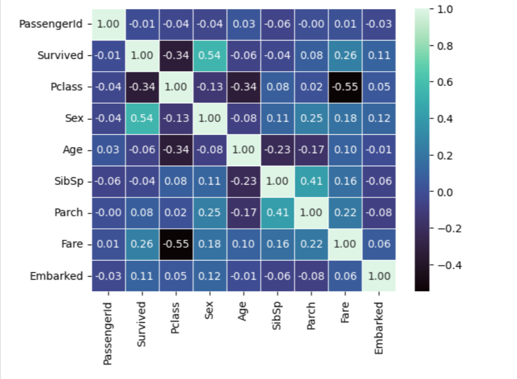
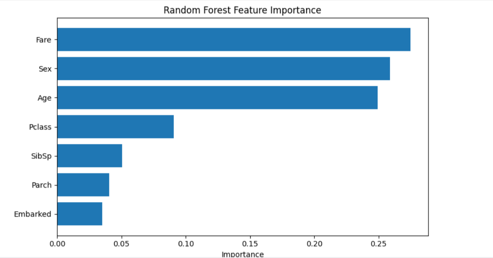
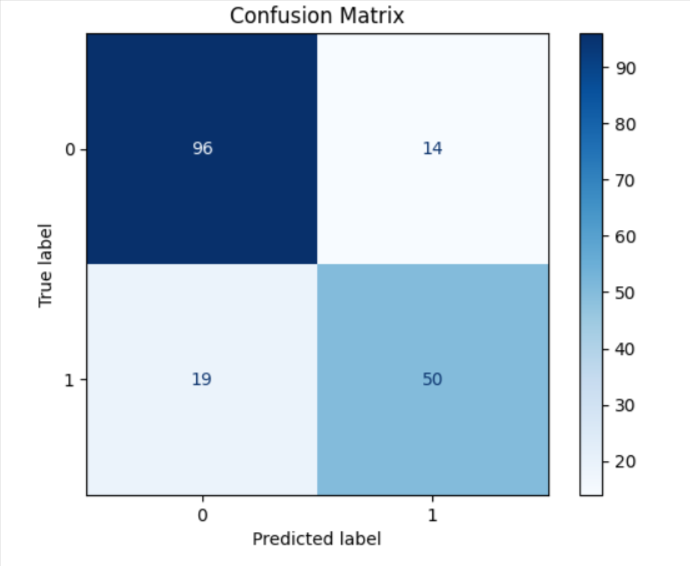

# 🚢 Titanic Survival Prediction


My first end-to-end machine learning project built for Kaggle's **Titanic: Machine Learning from Disaster** competition.

---

## 📌 Project Overview

The objective of this project is to predict whether a passenger survived the Titanic disaster using demographic and passenger information such as:

- Passenger Class
- Sex
- Age
- Fare
- Family Information
- Embarkation Port

The project demonstrates the complete machine learning workflow from data preprocessing to model evaluation and Kaggle submission.

---

## 🛠️ Technologies Used

- Python
- Pandas
- NumPy
- Matplotlib
- Seaborn
- Scikit-learn

---

## 📊 Workflow

- Data Loading
- Exploratory Data Analysis (EDA)
- Data Cleaning
- Missing Value Imputation
- Feature Encoding
- Stratified Train/Test Split
- Random Forest Classification
- Model Evaluation
- Kaggle Submission

---

## 📈 Results

| Metric | Score |
|--------|-------:|
| Validation Accuracy | **81.56%** |
| Kaggle Public Score | **0.75358** |

---

## 📷 Visualizations

### Correlation Heatmap



### Feature Importance



### Confusion Matrix



---

## 🚀 Future Improvements

- Feature Engineering
- Hyperparameter Tuning
- Cross Validation
- Model Comparison
- Ensemble Learning

---

## 📂 Repository Structure

```text
titanic-survival-prediction/
│
├── README.md
├── Titanic_Survival_Prediction.ipynb
└── images/
    ├── correlation_heatmap.png
    ├── feature_importance.png
    └── confusion_matrix.png
```

---

This repository documents my first complete machine learning project using Kaggle and Scikit-learn.
